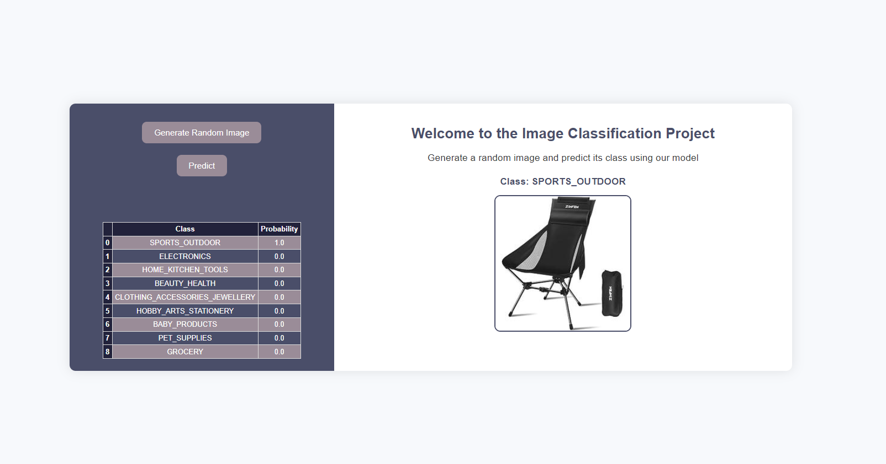

# Ecommerce Products Image Classification: MobileNetV2

## Project Overview

This project aims to classify products into their correct categories using computer vision techniques. Accurate categorization is crucial for e-commerce companies to enhance customer satisfaction and optimize sales. The model developed in this project helps reduce misclassification, increase sales, and improve the efficiency of the product categorization process.

This study is not a commercial product, rather an experimental progress and intended to contribute to open-source data science community.

### 1. Data Collection and Examination

We have collected ecommerce product images from various resources such as Amazon, Walmart, Google and other sources through scraping. Also Amazon Berkeley Objects (ABO) project used to enhance images in some categories. Finally we have reached a dataset of 18K images, properly resized into `224*224` pixels which is suitable for many pretrained CNN models. We used PILLOW for image processing and selenium for web scraping.

### 2. Dataset Creation

`18,175` images categorized in 9 classes mostly due to their major categories in Amazon. Furthermore, train-val-check sets arranged appropriately and train-val sets used for model training and a small check set reserved for model deployment to evaluate visually the model performance. The images is available on `static` folder

### 4. Model Training

The notebook for the study can be found at [kaggle](https://www.kaggle.com/code/fatihkgg/ecommerce-image-classification-mobilnetv2)

- **ImageDataGenerator**: Applied data augmentation techniques such as rotation, horizontal/vertical flipping, zoom, and brightness adjustments using Keras' ImageDataGenerator class to increase variation in the dataset and reduce overfitting.

- **Pre-trained Models**: Used transfer learning with models like VGG19, VGG16, ResNet, MobileNetV2, EfficientNet, and InceptionV3. The best performing model be seen as MobileNetV2

- **Optimization Algorithms**: Tested different optimization algorithms such as Adam and RMSprop to improve accuracy and reduce loss.

## Deployment with Streamlit

Flask and docker was used to deploy the model, enabling real-time interaction and visualization of the model's results. This streamlined the process of integrating the model into real-world applications.

## How to Clone and Run the Flask App

### Prerequisites

Ensure you have the following installed:

- Python 3.7+
- pip (Python package installer)

### Cloning the Repository

```bash
git clone https://github.com/fatih-ml/ecommerce_images_CV_classification/.git
cd ecommerce_images_CV_classification

python -m venv venv
source venv/bin/activate # On Windows use `venv\Scripts\activate`

pip install -r requirements.txt

flask run

```

### Accessing the App

Open your web browser and go to http://127.0.0.1:5000/ to interact with the app.



## Contributing

We welcome contributions and suggestions! Feel free to fork this repository and submit pull requests.

## Contact

For any questions or further information, you can reach out to me on [LinkedIn](https://www.linkedin.com/in/fatih-calik-ml/).

Thanks for reading and visiting our repo! We hope this project serves as a helpful educational resource.
